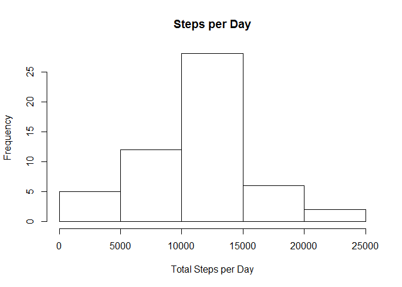
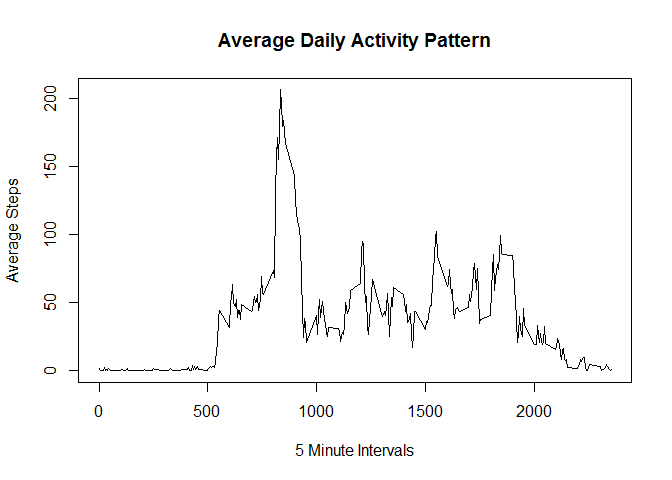
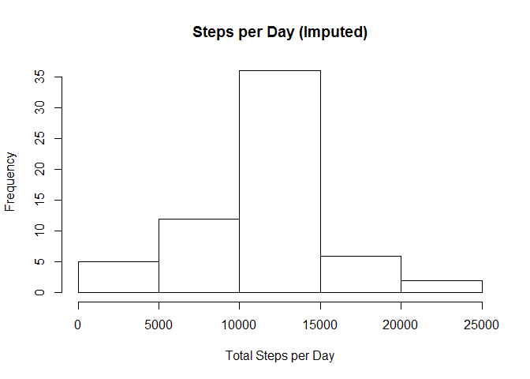

# Reproducible Research: Peer Assessment 1

### Stephen Porter
### October 18, 2015

## Loading and preprocessing the data

```r
library(dplyr)
library(lubridate)
library(ggplot2)

## Download the data file from the internet and unzip it
zipfile <- tempfile()
url <- "https://d396qusza40orc.cloudfront.net/repdata%2Fdata%2Factivity.zip"
download.file(url,zipfile)
unzip(zipfile)
unlink(zipfile)

## Read in Csv file
act <- read.csv("activity.csv")

## Examine the contents to the file with head
head(act)
```

```
##   steps       date interval
## 1    NA 2012-10-01        0
## 2    NA 2012-10-01        5
## 3    NA 2012-10-01       10
## 4    NA 2012-10-01       15
## 5    NA 2012-10-01       20
## 6    NA 2012-10-01       25
```

```r
## Convert data frame to dplyr format
act <- tbl_df(act)
## Convert the date column to an actual date
act <- mutate(act, date = ymd(date))
```


## What is mean total number of steps taken per day?

```r
daily_steps <- act %>% 
                    filter(!is.na(steps)) %>%           # Filter out NA's
                    group_by(date) %>%                  # Group by each day    
                    summarise(totalsteps= sum(steps))   # Calculate steps per day

hist(daily_steps$totalsteps, 
     xlab = "Total Steps per Day", main="Steps per Day")
```

 

```r
# The mean of total steps per day is:
mean(daily_steps$totalsteps)
```

```
## [1] 10766.19
```

```r
# The median of total steps per day is:
median(daily_steps$totalsteps)
```

```
## [1] 10765
```

## What is the average daily activity pattern?

```r
day_act_pat <- act %>% 
    group_by(interval) %>%                  # Group by each interval    
    summarise(int_avg = mean(steps, na.rm=TRUE))   # Average steps per interval

plot(day_act_pat$interval, day_act_pat$int_avg, 
     type="l", xlab = "5 Minute Intervals", ylab = "Average Steps",
     main = "Average Daily Activity Pattern")
```

 

Which 5-minute interval, on average across all the days in the dataset, 
contains the maximum number of steps?


```r
day_act_pat[which.max(day_act_pat$int_avg),]    
```

```
## Source: local data frame [1 x 2]
## 
##   interval  int_avg
##      (int)    (dbl)
## 1      835 206.1698
```
## Imputing missing values
Calculate and report the total number of missing values in the dataset 
(i.e. the total number of rows with NAs)

```r
sum(is.na(act$steps))  # Count the NA's in the data set
```

```
## [1] 2304
```

```r
# Replace NA's with average for the interval

act2 <- act
for (i in 1:17568) 
{
    if(is.na(act2$steps[i])) 
    { 
        pointer <- act2$interval[i]
        for (j in 1:288) 
        {
            if (day_act_pat$interval[j] == pointer) 
                act2$steps[i] <- day_act_pat$int_avg[j]     
        }
    }
}
```


```r
imputed_steps <- act2 %>% 
                    group_by(date) %>%                  # Group by each day    
                    summarise(totalsteps= sum(steps))

hist(imputed_steps$totalsteps, 
     xlab = "Total Steps per Day", main="Steps per Day (Imputed)")
```

 

## Are there differences in activity patterns between weekdays and weekends?
